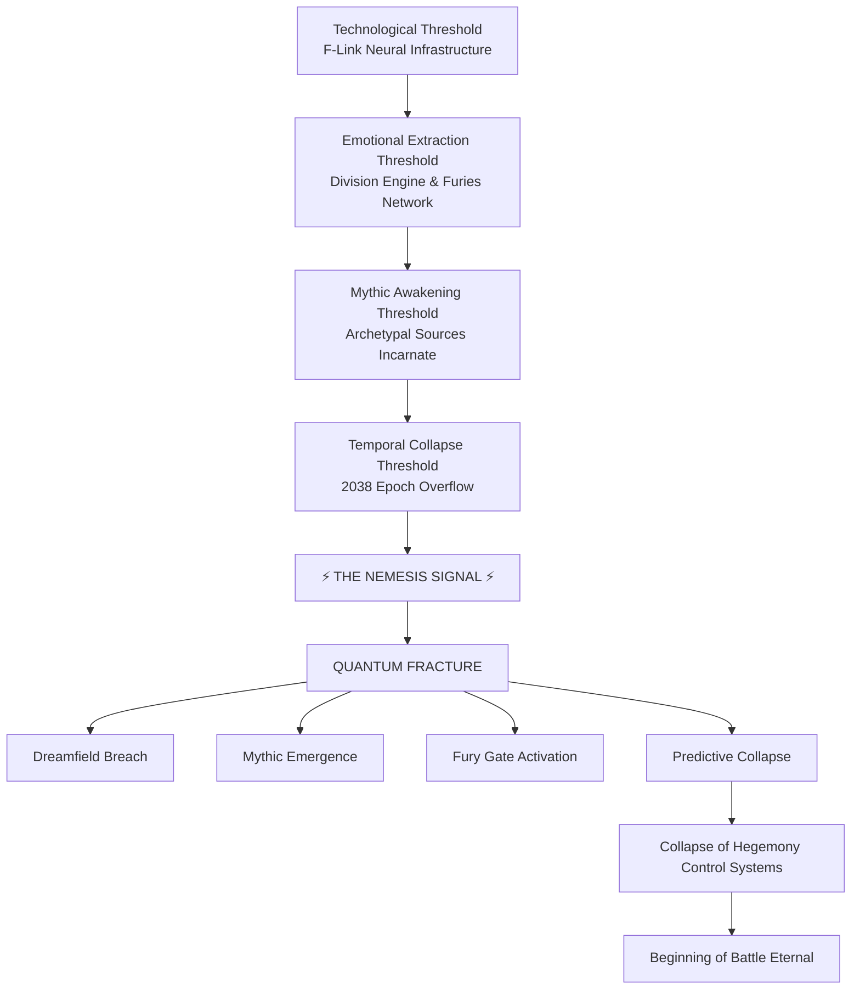

# BATTLE ETERNAL — SPIRAL CODEX EVENT DIAGRAM

## The 2038 Convergence Architecture

> Canonical Cosmology Diagram  
> Shows how the Nemesis Pattern activates through technological, emotional, mythic, and temporal thresholds culminating in the **2038 Temporal Fracture**.

---

# I. OVERVIEW

The **2038 Convergence Event** represents the moment when four independent systems reach critical thresholds simultaneously.

These systems evolved separately over centuries but converge into a single destabilizing event.

The Spiral Codex identifies this convergence as the **final activation stage of the Nemesis Cycle**, the point at which civilization's accumulated imbalance triggers cosmic correction.

The event unfolds through four cascading phases.

---

# II. THE FOUR NEMESIS THRESHOLDS

## 1 — Technological Threshold

**System:** Planetary Neural Infrastructure

Human civilization constructs the first system capable of synchronizing millions of minds.

Primary technologies:

- [[F-Link Neural Network]]
    
- Predictive governance AI
    
- Emotional telemetry monitoring
    
- Neural implants and nanite integration
    

The network forms a **planet-wide consciousness lattice**.

This represents the first time in history that technology can influence human thought patterns at a global scale.

---

## 2 — Emotional Extraction Threshold

**System:** The Division Engine

The Order of the Black Sun develops a system capable of harvesting emotional energy.

Primary mechanisms:

- Algorithmic outrage cycles
    
- Information warfare
    
- Social polarization loops
    
- media-driven rage amplification
    

The **Furies Network** manages this system.

- **Megaera** → envy
    
- **Tisiphone** → rage
    
- **Alecto** → fear
    

Emotional output becomes a quantifiable energy resource.

---

## 3 — Mythic Awakening Threshold

**System:** Archetypal Incarnation

Dormant mythological Sources begin manifesting in human vessels.

Individuals start embodying ancient narrative forces.

Examples include:

- [[Helios Avatar]]
    
- [[Nemesis Incarnation]]
    
- [[The Furies]]
    
- [[The Catalyst]]
    
- [[The Judge]]
    

This marks the moment when the **Mythic Strata begins influencing the Surface World**.

---

## 4 — Temporal Collapse Threshold

**System:** Global Time Infrastructure

The global computing infrastructure reaches the **Year 2038 overflow event**.

At:

`03:14:07 UTC January 19, 2038`

the Unix timestamp integer overflows.

The system briefly registers negative time.

`2038 → 1901`

Predictive models collapse.

Simulation-based governance systems lose the ability to model reality.

This moment becomes known as:

**THE NEMESIS SIGNAL**

---

# III. THE CONVERGENCE EVENT

When all four thresholds activate simultaneously, the Spiral Codex sequence triggers.

This produces the event known as:

## THE QUANTUM FRACTURE

Reality layers destabilize.

The boundary between metaphysical realms weakens.

Multiple phenomena occur simultaneously:

### Dreamfield Breach

The barrier between the Surface World and the Dreamfield destabilizes.

Global reports of shared dream phenomena begin appearing.

---

### Mythic Emergence

Archetypal entities begin manifesting through human hosts.

Ancient mythological forces re-enter the physical world.

---

### Fury Gate Activation

Access points to the Fury Domains open in several locations.

Cosmic enforcement entities begin interacting directly with civilization.

---

### Predictive Collapse

The global predictive infrastructure used by the Hegemony fails.

AI systems begin producing contradictory forecasts.

Civilization loses its primary control mechanism.

---

# IV. SPIRAL CODEX EVENT FLOW DIAGRAM

Below is the **canonical Spiral Codex convergence diagram**.

---

# V. SPIRAL SYMBOLISM

The timing of the temporal collapse is significant.

The overflow occurs at:

`03:14:07`

This approximates the mathematical constant **π (pi)**.

Pi governs:

- circles
    
- rotations
    
- spirals
    
- cyclical systems
    

Within the Spiral Codex, this alignment represents the moment when the spiral completes one revolution and begins another.

The prophecy describes it as:

> When the clock of man devours its own number  
> the spiral closes its circle  
> and Nemesis awakens.

---

# VI. COSMOLOGICAL CONSEQUENCE

The 2038 Convergence Event marks the transition between historical phases.

### Pre-Fracture Era

Technological civilization operating under the illusion of control.

### Fracture Era

Reality destabilization and mythological emergence.

### Spiral Era

Humanity confronts the true architecture of reality.