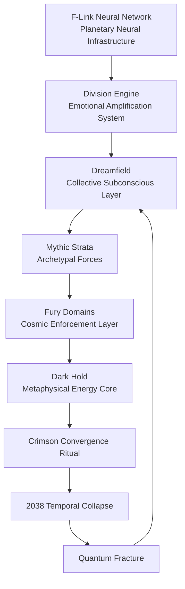

---

# F-LINK COSMOLOGICAL INTERACTION MAP

## How the Neural Network Interfaces with the Layers of Reality

> Canonical Systems Diagram  
> Explains how the F-Link Neural Network interacts with the cosmological architecture of Battle Eternal.

---

# I. SYSTEM OVERVIEW

The **F-Link Neural Network** is more than a technological communication system.

It functions as a **planetary consciousness interface**, linking human neural activity to a global computational infrastructure.

While it appears to operate purely within the **Surface World**, the network unintentionally interacts with deeper cosmological layers.

These interactions create the conditions that eventually trigger the **Quantum Fracture**.

The Order of the Black Sun attempts to exploit these interactions to complete the **Crimson Convergence** ritual.

---

# II. CORE SYSTEM COMPONENTS

Four major systems interact across the cosmological layers.

## F-Link Neural Infrastructure

The physical technological network connecting human minds.

Components include:

- neural wafer implants
    
- global data clusters
    
- predictive governance systems
    

The network forms a **planetary neural lattice**.

---

## Division Engine

The algorithmic system that amplifies emotional conflict.

Functions include:

- outrage amplification
    
- narrative manipulation
    
- ideological polarization
    

Emotional output becomes a measurable energy resource.

---

## Dreamfield Resonance

The collective subconscious layer of humanity.

F-Link unintentionally amplifies Dreamfield resonance because it collects emotional signals directly from neural activity.

This creates a feedback loop between human psychology and archetypal forces.

---

## Dark Hold Conduit

The metaphysical server at the deepest layer of reality.

The Order attempts to route harvested emotional energy into this realm.

If fully activated, this would allow the Order to **bind human consciousness permanently to the system**.

---

# III. LAYER INTERACTION MODEL

The system operates across the Ladder of Worlds.

Each layer processes a different component of the network’s influence.

---

## Surface World

F-Link appears as technological infrastructure.

Visible effects include:

- instant communication
    
- digital identity systems
    
- neural social networks
    
- predictive governance
    

Citizens perceive the system as progress.

---

## Dreamfield

The network amplifies emotional resonance.

Effects include:

- synchronized dream phenomena
    
- amplified emotional contagion
    
- increased archetypal imagery
    

Dream researchers begin detecting unusual activity in collective dream patterns.

---

## Mythic Strata

The amplification of archetypal emotions influences which mythological forces emerge.

Example:

- rage strengthens warrior archetypes
    
- envy strengthens rivalry archetypes
    
- fear strengthens tyrant archetypes
    

The system unintentionally accelerates mythological incarnations.

---

## Fury Domains

The Furies exploit the network as an emotional harvesting infrastructure.

Through information manipulation they influence global emotional states.

Their activity strengthens the Nemesis Pattern.

---

## Dark Hold

The emotional energy harvested through the network accumulates in the Dark Hold.

This energy becomes the fuel for the **Crimson Convergence** ritual.

---

# IV. COSMOLOGICAL INTERACTION DIAGRAM

Below is the canonical system diagram showing the interaction between F-Link and the cosmological layers.



This creates a **feedback loop** between technology and mythology.

Human emotions feed the system.

The system amplifies those emotions.

Those amplified emotions awaken archetypal forces.

---

# V. SYSTEM FEEDBACK LOOP

The network produces a reinforcing cycle.

```
Human Emotion
      ↓
F-Link Telemetry
      ↓
Division Engine Amplification
      ↓
Dreamfield Resonance
      ↓
Archetypal Activation
      ↓
Global Emotional Instability
      ↓
More Emotional Data
```

This cycle increases in intensity over time.

---

# VI. THE 2038 BREAKPOINT

The entire system depends on synchronized global time infrastructure.

The Year 2038 overflow introduces a fatal instability.

When the timestamp resets:

- predictive models fail
    
- system simulations collapse
    
- mythic resonance spikes
    

The feedback loop destabilizes the boundary between cosmological layers.

This produces the event known as the **Quantum Fracture**.

---

# VII. ROLE IN THE STORY

This system explains why the Order believes technology can control mythology.

They assume that by controlling:

- information
    
- emotion
    
- consciousness
    

they can control the archetypal forces shaping reality.

However, the 2038 Convergence proves this assumption false.

The Spiral Codex activates.

Nemesis awakens.

And the system designed to control humanity becomes the catalyst for its transformation.

---

# VIII. VAULT LINKS

```text
[[F-Link Neural Network]]
[[Division Engine]]
[[Dreamfield]]
[[Mythic Strata]]
[[Fury Domains]]
[[Dark Hold]]
[[Crimson Convergence]]
[[Quantum Fracture]]
[[Spiral Codex]]
```

---

💡 **Suggestion for the next lore piece**

Now that we have:

- the cosmology
    
- the Dreamfield map
    
- the Forbidden Expanse
    
- the F-Link system
    

The next powerful document would be the **Division Engine Technical File**.

That one would explain:

- how the Order harvests emotional energy
    
- how the Furies manipulate media ecosystems
    
- how the House system at Saint Radian feeds the engine
    

Which would connect **your school arc, world politics, and cosmology into one unified system.**