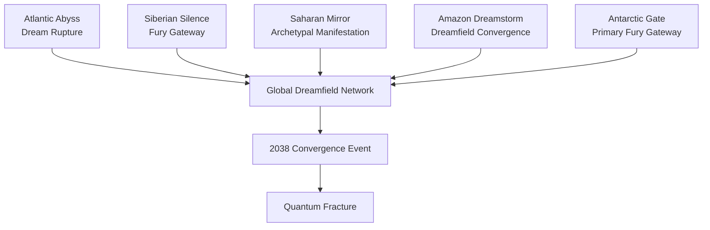

# Dreamfield Ruptures, Fury Gateways &Hidden Mythic Territories

> Classified Atlas Document  
> Compiled from Order of the Black Sun reconnaissance data and resistance intelligence leaks.

---

# I. OVERVIEW

The **Forbidden Expanse** refers to regions of the planet officially sealed by the Hegemony under the justification of environmental catastrophe, radiation zones, or military quarantine.

In reality, these territories contain **massive Dreamfield rupture sites and mythological pressure points** where the barrier between reality layers has weakened.

These regions exist where the **Surface World intersects directly with deeper cosmological layers**, including:

- the Dreamfield
    
- the Mythic Strata
    
- the Fury Domains
    

Such locations are extremely unstable and often produce phenomena that cannot be explained through conventional physics.

For this reason, they have been designated **Global Exclusion Zones**.

---

# II. WHY THE HEGEMONY HIDES THESE ZONES

The official narrative claims these areas are too dangerous for human habitation.

The real reasons are far more significant.

These territories contain:

- dormant mythological structures
    
- Dreamfield rupture events
    
- ancient civilizations tied to the Nemesis Cycle
    
- Fury Gateways capable of manifesting cosmic enforcement entities
    

The Order of the Black Sun considers these zones **planetary pressure valves** for the cosmological system.

If humanity became aware of them, the illusion of normal reality would collapse.

---

# III. GLOBAL FORBIDDEN EXPANSE REGIONS

## The Atlantic Abyss

Location: Central Atlantic Ocean

Type: Dreamfield Rupture Zone

Phenomena:

- massive dream echo storms
    
- ancient submerged architecture
    
- time dilation anomalies
    

Some Order scholars believe this region corresponds to the remains of **Atlantis**, the first civilization destroyed during a Nemesis cycle.

---

## The Siberian Silence

Location: Northern Eurasia

Type: Fury Gateway

Phenomena:

- unexplained disappearances
    
- electromagnetic disturbances
    
- spontaneous psychological collapse among explorers
    

Several expeditions reported encountering **entities resembling the Erinyes** before all communications ceased.

---

## The Saharan Mirror

Location: Central Sahara

Type: Archetypal Manifestation Site

Phenomena:

- mirage structures that remain stable for hours
    
- ruins appearing and disappearing within sandstorms
    
- symbolic dream architecture visible to multiple observers simultaneously
    

Many researchers believe this region once housed an advanced mythological civilization destroyed during an early Spiral cycle.

---

## The Amazon Dreamstorm

Location: Upper Amazon Basin

Type: Dreamfield Convergence Zone

Phenomena:

- collective dream hallucinations among nearby populations
    
- animals exhibiting mythological traits
    
- plant structures growing in impossible geometric patterns
    

The density of biological life appears to amplify Dreamfield resonance.

---

## The Antarctic Gate

Location: Subglacial Antarctic continent

Type: Primary Fury Gateway

Phenomena:

- gravitational distortions
    
- massive underground structures
    
- unknown energy signatures detected beneath the ice
    

This is believed to be one of the **largest Fury Domain access points on Earth**.

The Order maintains a covert research facility nearby.

---

# IV. DREAMFIELD ANOMALY TYPES

Within Forbidden Expanse regions, several anomaly categories appear repeatedly.

### Dreamfield Rupture

Large-scale emotional and symbolic energy leaking into physical reality.

Symptoms include:

- dream entities manifesting physically
    
- symbolic storms
    
- spatial distortion
    

---

### Fury Gate

Permanent access points to the Fury Domains.

When activated, Nemesis entities may manifest to enforce cosmic balance.

---

### Mythic Territory

Regions where archetypal forces dominate the physical environment.

Reality itself begins behaving according to mythological narrative logic.

---

### Lost Civilization Site

Ruins of civilizations destroyed during earlier Nemesis cycles.

These locations often contain ancient technology or metaphysical artifacts.

---

# V. FORBIDDEN EXPANSE GLOBAL MAP DIAGRAM

Below is the simplified atlas diagram of major Forbidden Expanse zones.

---

# VI. ROLE IN THE STORY

Forbidden Expanse zones become extremely important after the **2038 Convergence Event**.

When the **Quantum Fracture** destabilizes reality layers:

- Dreamfield ruptures expand
    
- Fury Gateways activate
    
- mythological entities manifest physically
    

Many future story arcs occur within these regions as explorers attempt to understand the true structure of reality.

These zones represent the **frontier of the Battle Eternal universe**.