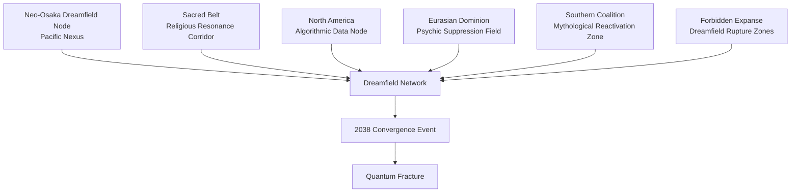

---

# BATTLE ETERNAL — GLOBAL DREAMFIELD MAP

## Convergence Zones & Mythological Pressure Points

> Canonical Atlas Document  
> Maps the areas of Earth where the **Dreamfield overlaps the Surface World**, producing anomalies, archetypal manifestations, and Fury Gateway activity.

---

# I. WHAT THE DREAMFIELD IS

The **Dreamfield** is the shared subconscious layer of humanity.

It acts as the **translation layer between psychological reality and mythological forces**, converting human emotion, memory, and symbolic thought into archetypal structures.

Normally, the Dreamfield is separated from the physical world by a metaphysical barrier.

However, certain geographic regions weaken this barrier.

These areas are called:

**Dreamfield Convergence Zones**

Within these zones:

- dreams bleed into waking reality
    
- archetypal imagery manifests physically
    
- mythological entities gain influence
    
- time perception becomes unstable
    

---

# II. TYPES OF DREAMFIELD ANOMALIES

Dreamfield anomalies appear in several forms across the planet.

### 1 — Convergence Zones

Locations where Dreamfield resonance becomes unusually strong.

Symptoms:

- mass shared dreams
    
- emotional amplification
    
- spontaneous symbolic visions
    

---

### 2 — Fury Gateways

Permanent openings between the Surface World and the Fury Domains.

These locations allow Nemesis entities to intervene directly.

Effects include:

- moral judgment phenomena
    
- sudden collapses of corrupt institutions
    
- violent psychological breakdowns among perpetrators
    

---

### 3 — Archetypal Manifestation Sites

Areas where mythological archetypes have historically appeared.

Often associated with:

- ancient temples
    
- sacred geometry structures
    
- ancient battlefields
    

---

### 4 — Dream Ruptures

Highly unstable zones where Dreamfield energy floods the physical world.

These areas are extremely dangerous.

Phenomena include:

- reality distortions
    
- dream creatures manifesting physically
    
- time fragmentation events
    

---

# III. MAJOR DREAMFIELD CONVERGENCE REGIONS

## Pacific Nexus — Neo-Osaka Dreamfield Node

The most technologically advanced city in the world sits atop one of the strongest Dreamfield convergence zones.

Key elements:

- F-Link neural research labs
    
- Saint Radian Institute
    
- Dreamfield experimentation programs
    

Neo-Osaka functions as the **primary research site for Dreamfield science**.

However, the Order secretly exploits this location because neural infrastructure amplifies Dreamfield resonance.

---

## Sacred Belt — Religious Resonance Corridor

This region contains the highest density of historical religious sites.

Cities include:

- Alexandria Prime
    
- New Constantinople
    
- Neo-Venice
    
- São Paulo
    

Dreamfield activity here manifests through:

- prophetic visions
    
- religious apparitions
    
- mass spiritual experiences
    

The Apostolic Communion interprets these events as evidence of divine neural communion.

---

## North American Algorithmic Node

The largest F-Link data cluster sits within North America.

The massive concentration of emotional telemetry data causes unusual Dreamfield distortions.

Symptoms include:

- reality perception fragmentation
    
- ideological dream warfare
    
- predictive algorithm failure
    

The Atlas Cluster eventually detects events that its models cannot explain.

This is the first technical sign of the **Quantum Fracture**.

---

## Eurasian Dominion — Psychic Suppression Field

The Dominion enforces strict digital and psychological control.

Heavy surveillance and emotional regulation suppress Dreamfield activity.

However, this suppression creates pressure buildup.

Occasional Dreamfield ruptures here are extremely violent.

---

## Southern Coalition — Mythological Reactivation Zone

This region contains many of the world's oldest mythological sites.

Dreamfield resonance activates ancient archetypes connected to:

- African mythology
    
- Mesoamerican myth
    
- South Asian cosmology
    

The Southern Coalition becomes a major battleground for emerging prophecy movements.

---

# IV. THE FORBIDDEN EXPANSE

Large regions of Earth are officially restricted by the Hegemony.

Public explanation:

- radiation zones
    
- environmental collapse
    
- military quarantine
    

The true reason:

These areas contain **massive Dreamfield rupture sites**.

Common phenomena include:

- mythic creatures appearing physically
    
- gravitational anomalies
    
- impossible architecture emerging from Dream structures
    

These territories are almost completely unexplored.

They represent the **future exploration frontier of Battle Eternal**.

---

# V. MASTER DREAMFIELD MAP DIAGRAM

Below is the simplified planetary Dreamfield anomaly map.



---


---

# VI. ROLE IN THE STORY

Dreamfield zones become extremely important during the **2038 Convergence Event**.

When the temporal collapse occurs:

- Dreamfield activity spikes globally
    
- archetypal forces emerge into the Surface World
    
- Fury Gateways activate simultaneously
    

These events trigger the **Quantum Fracture**, destabilizing reality itself.

---

# VII. VAULT LINK STRUCTURE

Recommended Obsidian links for this page:

```
[[Dreamfield]]
[[Spiral Codex]]
[[Nemesis Cycle]]
[[Quantum Fracture]]
[[Forbidden Expanse]]
[[Fury Domains]]
[[Saint Radian Academy]]
[[Order of the Black Sun]]
```

---

