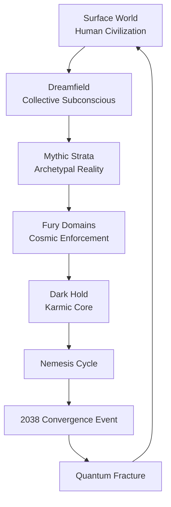

- a **canonical lore page**
    
- a **visual diagram (Mermaid)** that renders in Obsidian
    
- a **hub document** linking the rest of the cosmology system
    

This becomes the **central map of reality for Battle Eternal**.

---

# BATTLE ETERNAL — MASTER COSMOLOGY MAP

## The Spiral Codex Architecture of Reality

> Canonical cosmology diagram of the Battle Eternal universe.  
> This document visualizes the structure of reality, the Spiral Codex system, and the 2038 Convergence Event.

---

# I. THE ARCHITECTURE OF EXISTENCE

Reality in the Battle Eternal universe is structured as a layered metaphysical system known as **The Ladder of Worlds**.

Each layer of reality processes different aspects of human existence.

Humanity perceives only the **Surface World**, while deeper layers govern dreams, archetypes, morality, and cosmic balance.

The layers function like a vertical ecosystem.

Human choices generate consequences that descend downward through the system.

Judgment and correction then rise upward.

---

# II. THE FIVE REALMS OF REALITY

## Realm I — Surface World

The material world where civilization exists.

Key systems:

- [[The Hegemony]]
    
- [[F-Link Neural Network]]
    
- [[Saint Radian Academy]]
    
- Global corporate directorates
    

Characteristics:

- physical reality
    
- political power
    
- technological infrastructure
    
- emotional conflict
    

This is where **human choices originate**.

---

## Realm II — Dreamfield

The collective subconscious of humanity.

Properties:

- shared dream environments
    
- symbolic landscapes
    
- archetypal imagery
    
- emotional resonance fields
    

Dream researchers and Oneiromancers can navigate this realm.

The Dreamfield functions as the **translation layer between human psychology and mythological forces**.

---

## Realm III — Mythic Strata

The layer where narrative archetypes exist as real entities.

Here, stories are not metaphors.

They are **active forces shaping reality**.

Examples of archetypal entities:

- [[Helios]]
    
- [[Nemesis]]
    
- [[The Furies]]
    
- [[The Judge]]
    
- [[The Catalyst]]
    

When these archetypes incarnate in human vessels, mythological events begin occurring in the Surface World.

---

## Realm IV — Fury Domains

The cosmic enforcement layer of moral balance.

This realm contains the **Furies**, ancient forces that maintain equilibrium across civilizations.

The Three Furies:

- **Megaera** — punishment of betrayal
    
- **Tisiphone** — punishment of murder
    
- **Alecto** — punishment of corruption
    

They do not enforce human law.

They enforce **cosmic balance**.

---

## Realm V — The Dark Hold

The deepest layer of reality.

This realm contains:

- karmic accumulation
    
- metaphysical debt
    
- harvested emotional energy
    
- the **Server Zero** core exploited by the Order of the Black Sun
    

The Order attempts to convert this realm into a planetary power source.

---

# III. FLOW OF CONSEQUENCE

Two flows move through the cosmological system.

### Downward Flow — Consequence

```
Surface World
     ↓
Dreamfield
     ↓
Mythic Strata
     ↓
Fury Domains
     ↓
Dark Hold
```

Human choices generate emotional and moral energy that descends through the system.

---

### Upward Flow — Judgment

```
Dark Hold
     ↑
Fury Domains
     ↑
Mythic Strata
     ↑
Dreamfield
     ↑
Surface World
```

When imbalance becomes too great, corrective forces rise upward.

This is the mechanism behind the **Nemesis Cycle**.

---

# IV. THE SPIRAL CODEX

The Spiral Codex describes how civilizations evolve through repeating cycles.

However, these cycles do not repeat identically.

Each cycle occurs at a **higher level of complexity**.

Technology increases the scale of civilization's power.

This also increases the scale of potential imbalance.

When imbalance reaches a critical threshold, the **Nemesis Pattern activates**, triggering systemic correction.

---

# V. THE 2038 CONVERGENCE

In the Digital Age, several thresholds converge simultaneously:

- planetary neural infrastructure
    
- emotional harvesting systems
    
- mythological archetype emergence
    
- global time synchronization failure
    

The final trigger occurs during the **Year 2038 overflow event**.

This produces the **Temporal Collapse Threshold**.

The Spiral Codex identifies this moment as:

**THE NEMESIS SIGNAL**

---

# VI. MASTER COSMOLOGY DIAGRAM

This diagram shows the relationship between the five realms and the 2038 convergence event.



This structure forms a **cosmic spiral loop**.

Reality feeds into consequence.

Consequence eventually reshapes reality.

---

# VII. THE COSMIC SPIRAL

The entire cosmological system forms a spiral rather than a circle.

```
Civilization Rise
       ↓
Technological Expansion
       ↓
Moral Imbalance
       ↓
Nemesis Activation
       ↓
Civilizational Correction
       ↓
New Cycle at Higher Complexity
```

Each cycle amplifies the stakes.

The Digital Age represents the **largest spiral turn in human history**.

---

# VIII. POSITION IN THE LORE BIBLE

Recommended vault structure:

```
Cosmology/

  Master Cosmology Map.md

  Spiral Codex/
      Spiral Codex.md
      Nemesis Cycle.md
      2038 Convergence Event.md

  Realms/
      Surface World.md
      Dreamfield.md
      Mythic Strata.md
      Fury Domains.md
      Dark Hold.md
```

---

# IX. ROLE IN THE STORY

The cosmology system explains the deeper conflict of **Battle Eternal**.

Civilization believes the primary conflict is technological.

In reality, the conflict is metaphysical.

Humanity is caught between two forces:

**External AI**

systems attempting to control human consciousness.

and

**Internal Divine Intelligence**

the archetypal forces seeking to awaken within humanity.

The collision of these forces begins with the **2038 Convergence Event**.

This marks the beginning of the **Battle Eternal**.

---

